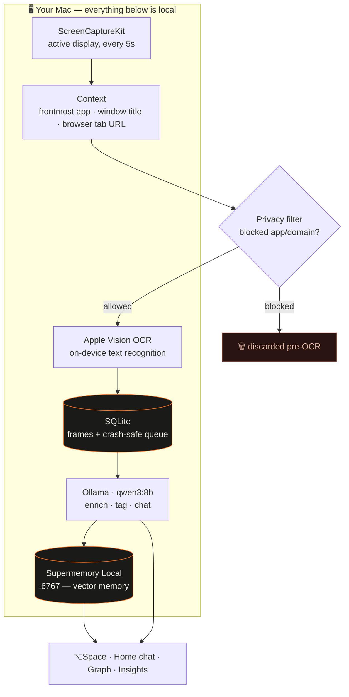
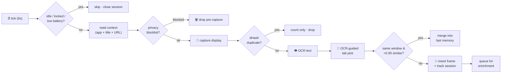
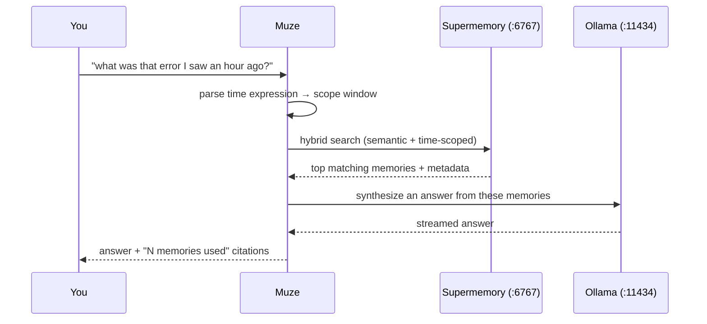
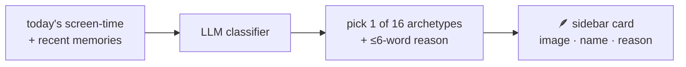

<div align="center">

# 🪶 Muze

### *Your mind, remembered.*

**A local-first macOS app that quietly remembers everything you see — so you never have to.**

Muze passively watches your screen, reads the text on it with on-device OCR, and turns your day
into a searchable, chattable memory. Ask it what you saw. Watch your ideas connect on a graph.
Get resurfaced the thing you swore you'd remember. All of it runs on `localhost` — **nothing
ever leaves your machine.**

`Rewind × Supermemory × a little mythology` — rebuilt on `localhost:6767`.

</div>

---

## ✨ Why Muze exists

You read a hundred things a day and remember five. The great error you saw in the terminal an
hour ago, the tweet you meant to save, the paragraph in a PDF — all gone. Muze is the memory
layer your laptop never had:

- 🧠 **It remembers passively** — no tagging, no filing. Just live your day.
- 🔍 **It answers, not recites** — ask in plain language, get a synthesized answer with sources.
- 🕸 **It connects** — related memories link into a graph you can explore.
- 🔒 **It's private by default** — on-device OCR, local LLM, local storage. Works with WiFi off.
- 🪶 **It's beautiful** — an Are.na-meets-editorial aesthetic, serif headlines, film grain, a
  daily mythological "who you are today."

---

## 🎬 The 60-second tour

| Do this | Get this |
|---|---|
| **Just work** | Muze captures your screen every 5s, keeps only the *text*, and builds memories in the background. |
| **⌥ Space** | A Spotlight-style bar: *"what was that Postgres error I saw this morning?"* → a real answer, with the memories it used. |
| **⌥ S** | Deliberately save whatever's on screen right now as a keeper memory. |
| **Home tab** | Chat with your memory + live **screen-time** (top apps/sites), a **MUZE NOTICED** insight card, and a **STILL RECALL THIS** resurfacer. |
| **Memory Graph** | Every memory is a node; semantically related ones link into constellations. |
| **Canvas** | A freeform board to pull memories onto and think spatially. |
| **Sidebar** | **TODAY YOU ARE** — casts your day's consumption into one of 16 mythological archetypes. |

---

## 🗜 The storage trick — a year of memory in single-digit GB

Screens are huge; text is tiny. **Muze never persists pixels.**

```
every 5s:  📸 capture ─▶ 🔁 dHash dedupe ─▶ 👁 Vision OCR ─▶ 🗑 discard the frame
                                                          └─▶ 💾 keep ~2–5 KB of text
```

- **~90% of frames are dropped** by a 64-bit perceptual hash (dHash) before OCR — static screens
  and idle time cost nothing.
- A second layer merges consecutive frames from the same window with **>0.95 text similarity**, so
  scrolling one document ≠ 40 memories.
- Kept per frame: a few KB of text + an optional 480px thumbnail (~20 KB) for the timeline.

**A full day is a few MB. A year fits in single-digit GB.**

---

## 🏗 How it's wired



Everything with a port lives on `localhost`. The only network calls are to `:6767` (Supermemory)
and `:11434` (Ollama) — both on your machine.

---

## ⚙️ The capture pipeline, step by step



**Sessions, not frames.** Rather than one memory per screenshot, Muze groups frames from a single
app-session (until you switch apps, go idle 5 min, or hit 40 frames). At ingest it builds *one*
rich memory from the **novel** lines across the session — content, not repeated UI chrome.

**Why enrich before storing?** Supermemory's memory agent extracts nothing useful from raw UI text.
So Muze first runs the session digest through the LLM into a first-person summary + facts + category
+ tags, and stores *that*. Full OCR stays local in SQLite. Enrichment is a **crash-safe background
queue** — it never blocks capture, and rows are only deleted after a successful ingest (failures
back off exponentially).

---

## 💬 What happens when you ask (⌥ Space)



The chat is tuned to **synthesize insight**, not read your memories back to you — you can already
see those. Scope it to **Saved**, **Screen**, or **All** memories.

---

## 🏛 TODAY YOU ARE — the character system

Muze reads what you consumed today (screen-time + saved/seen content) and casts you as **one of 16
mythological archetypes**, with a short reason naming the dominant theme.



The roster spans Greek, Egyptian, Norse, Chinese and Hindu myth — **Prometheus** (AI papers &
rebellion), **Athena** (wisdom & strategy), **Dionysus** (films & music & chaos), **Icarus**
(hustle & ambition), **Loki** (memes & internet culture), **Thoth**, **Odin**, **Sun Wukong**,
**Arjuna**, **Krishna**, and more. It re-reads your day a few times daily and caches the result.

> Example: a day of startup content and productivity tools → **Icarus · Ambition** ·
> *"Hustle culture & productivity."*

---

## ⏱ Screen time — the real numbers

Muze shows an honest picture of where your attention went:

- **Total** comes from **macOS's native Screen Time** (`knowledgeC.db`) when Full Disk Access is
  granted — the same number Settings shows — and falls back to Muze's own tracker otherwise.
- **Breakdown** shows your top apps *and* — uniquely — the top **sites** inside your browser
  (e.g. `youtube.com`, not just "Chrome"), attributed by the active tab.

---

## 🚀 Setup & run

**Prerequisites**

| Dependency | Port | Purpose |
|---|---|---|
| [Supermemory Local](https://supermemory.ai/docs/self-hosting/overview) (`supermemory-server`) | `6767` | vector memory store |
| [Ollama](https://ollama.com) + `qwen3:8b` | `11434` | on-device LLM (enrichment, tagging, chat) |

```bash
# 1. start the engines (Muze can also auto-launch them for you)
supermemory-server                 # :6767
ollama pull qwen3:8b && ollama serve  # :11434

# 2. build & install Muze
cd Muze
./Scripts/make-app.sh              # swift build + .app assembly + codesign + install
open /Applications/Muze.app
```

On first launch, onboarding walks you through granting **Screen Recording** + **Accessibility**
(and optionally **Full Disk Access** for native Screen Time). Prefer a cloud model? Switch the
provider in **Settings → Services** to OpenAI, Anthropic, or any OpenAI-compatible endpoint with
your own key.

<details>
<summary><b>🔧 Signing & troubleshooting</b></summary>

- The build script signs with your **Apple Development** certificate so macOS TCC permissions
  survive rebuilds. Ad-hoc signing silently breaks Screen Recording on every rebuild (learned the
  hard way).
- If permissions read as *granted* but capture is dead, the TCC entry is stale:
  ```bash
  tccutil reset ScreenCapture dev.shivam.recall
  ```
  then re-grant.
- Data lives in `~/Library/Application Support/Recall/` (SQLite + thumbnails). The path keeps the
  original app name so existing memories survive the rename to Muze.

</details>

---

## 🔒 Privacy, by construction

- **Blocklisted apps & domains** (password managers, banking, checkout pages by default) are
  discarded **before capture** — never OCR'd, never queued, never stored.
- **Pause anytime** (15 min / 1 hr / ∞), auto-pause on idle, screen lock, or low battery.
- **You own the data**: export everything to JSONL, or forget any time range (wipes both local
  SQLite *and* the engine).
- **Local by default**: with Ollama, screen text never leaves the machine. (Choosing a cloud LLM
  provider does send text off-device for enrichment/chat — clearly noted in Settings.)

---

## 🧩 Tech stack

| Layer | Tech |
|---|---|
| **App** | Swift · SwiftUI · AppKit (native macOS, dock app) |
| **Capture** | ScreenCaptureKit · Apple Vision OCR · NSWorkspace · AppleScript (browser tabs) |
| **Storage** | SQLite via [GRDB](https://github.com/groue/GRDB.swift) · Supermemory Local (vectors) |
| **Intelligence** | Ollama (`qwen3:8b`) · OpenAI / Anthropic / custom (optional) |
| **Screen time** | macOS `knowledgeC.db` + a site-level activity tracker |
| **Design** | Ovo serif · custom theme tokens · film grain · bundled archetype art |

---

## 🗂 Project structure

```
Muze/
├─ Sources/Muze/
│  ├─ Engine.swift              # orchestrates capture → dedupe → OCR → store
│  ├─ Services/
│  │  ├─ CaptureService         # ScreenCaptureKit
│  │  ├─ OCRService             # Apple Vision
│  │  ├─ DedupeService          # perceptual dHash
│  │  ├─ ContextService         # frontmost app + OCR-guided tab pick
│  │  ├─ PrivacyFilter          # app/domain blocklists
│  │  ├─ IngestWorker           # crash-safe queue → Supermemory
│  │  ├─ EnrichmentService      # LLM: summary/facts/tags/category
│  │  ├─ SupermemoryClient      # /v3/documents, /v4/search
│  │  ├─ GraphService           # memory graph edges
│  │  ├─ InsightsService        # "MUZE NOTICED" cards
│  │  ├─ CharacterService       # TODAY YOU ARE archetypes
│  │  ├─ ActivityTracker        # per-app / per-site screen time
│  │  └─ ScreenTimeReader       # native knowledgeC.db
│  ├─ UI/                       # MainWindow · ChatWindow · Graph · Canvas · Character · Settings
│  ├─ Store/                    # GRDB models + canvas
│  └─ Support/                  # Settings · HotKey · Permissions · Icons
├─ Resources/                   # Ovo font · 16 archetype images · app icon
└─ Scripts/make-app.sh          # build + sign + install
```

---

<div align="center">

*Built for the **Localhost:6767** hackathon — a love letter to memory that never leaves your machine.*

🪶

</div>
