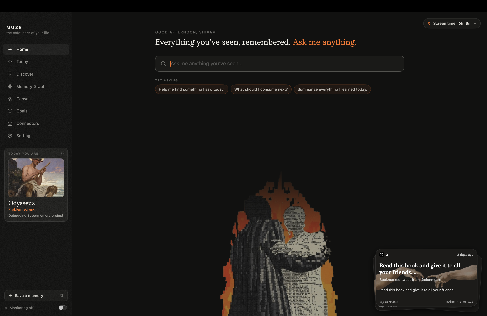
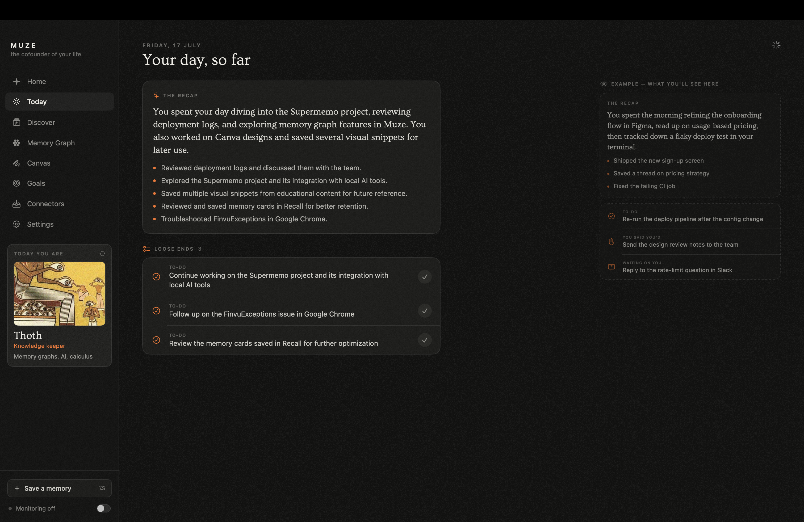
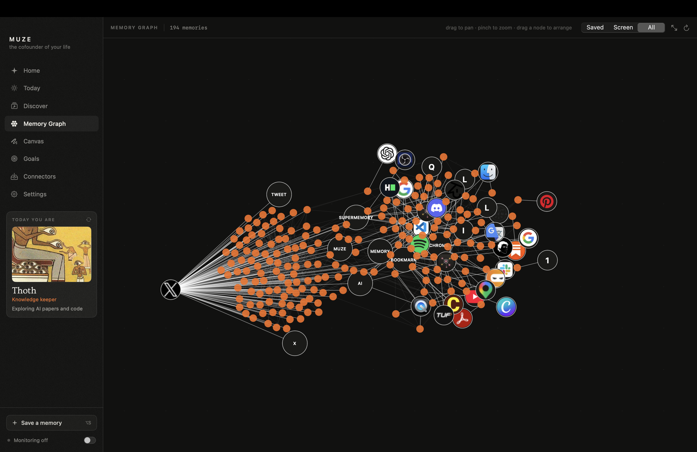
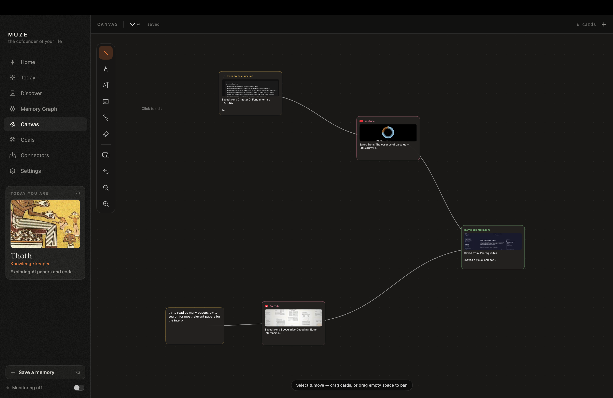
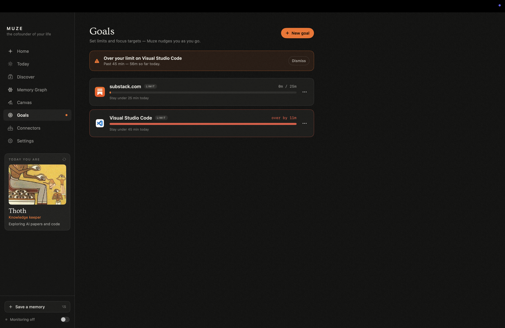
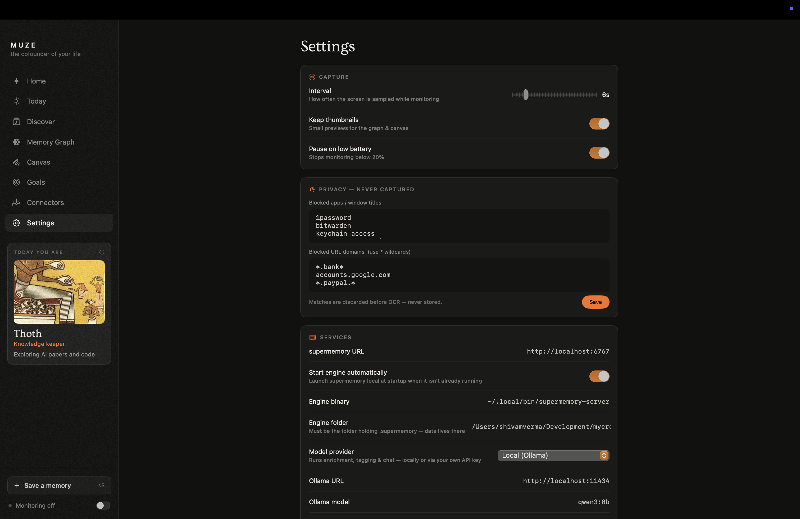
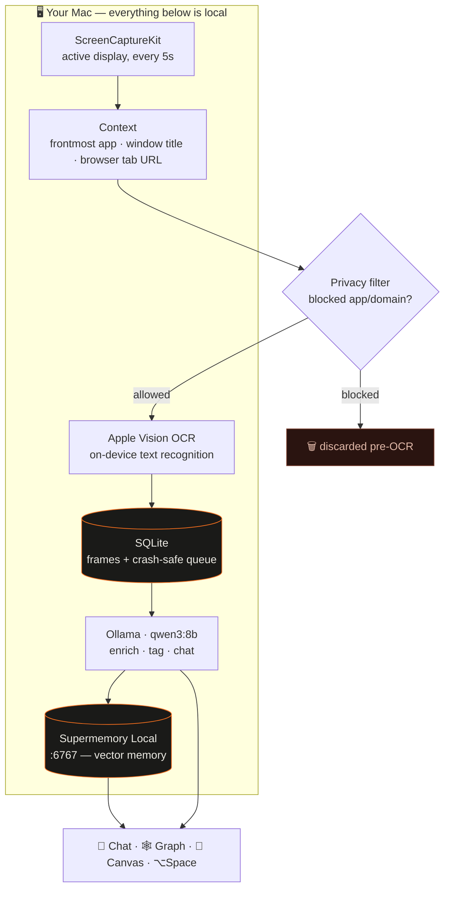
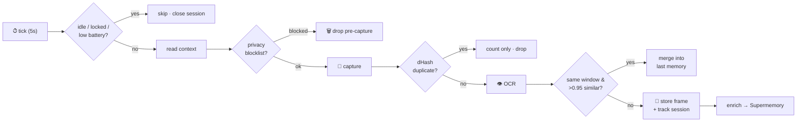
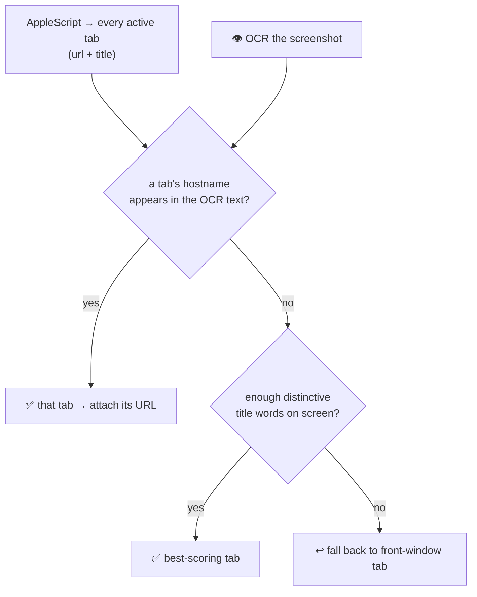
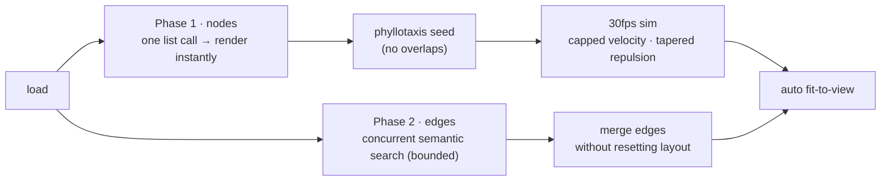

<div align="center">

# 🪶 Muze

### *Your mind, remembered.*

**A local-first macOS app that quietly remembers everything you see — then lets you chat with it, map it, and explore it.**

Muze passively watches your screen, reads the text on it with on-device OCR, and turns your day
into a searchable memory. Then it gives you every way back in: **chat with it, feed on it,
map it, board it, budget it.** All of it runs on `localhost` — **nothing ever leaves your machine.**



</div>

---

## 🗺 The grand tour

### 💬 Home — talk to everything you've ever seen

That's it up top ☝️ — *"Everything you've seen, remembered. Ask me anything."* Ask in plain
language — *"what was that error I saw an hour ago?"* — and get a **synthesized answer with
citations** to the actual moments, not a wall of screenshots. Summon it from anywhere with
**⌥Space**; save anything on screen deliberately with **⌥S**. And that card in the corner? A
deck of your forgotten saves — the Creation-of-Adam hands asking *still recall this?* —
**swipe** to draw the next one, **tap** to revisit.

### 🌅 Today — your day, replayed

<p align="center"></p>

Where your hours actually went — top apps *and* the top **sites inside your browser**
(`youtube.com`, not just "Chrome"), read from macOS's own Screen Time database. **✦ MUZE
NOTICED** surfaces the non-obvious patterns in your day, and **🏛 TODAY YOU ARE** casts your
consumption into one of **16 mythological archetypes**. Some days you're Athena. Some days
you're Icarus. The app doesn't lie.

### 🧭 Discover — the feed of your own past

<p align="center"></p>

Every bookmark and save as a **YouTube-style mosaic feed** — thumbnails fetched automatically,
uniform rows, organic widths. **For You** ranks it by what you've *actually been consuming
lately* (binge AI for a week and AI floats up); **Timeline** is the archive, day by day, back
to bookmarks you made years ago. A progress bar tracks how much of your own curiosity you've
finally consumed. *Surprise me* is the slot machine.

### 🕸 Memory Graph — your mind as a constellation

<p align="center"></p>

Every memory is a star; semantic similarity draws the lines. A hand-rolled physics engine
settles hundreds of nodes into constellations you can fly through — related ideas find each
other without you filing anything, ever.

### 🎨 Canvas — think with your memories

<p align="center"></p>

A freeform board: pull saved memories out as cards, scribble, connect, arrange. It's the
difference between *having* memories and *thinking with* them.

### 🎯 Goals — your intentions, enforced by your actual screen time

<p align="center"></p>

*"Only 15 minutes of Substack today."* Set a **limit** or a **focus target** per app or per
site, watch live progress rings fill against your real tracked time, and get a native
notification + in-app banner the moment you cross the line. Resets at midnight; no judgment,
just receipts.

### 🔌 Connectors — import your entire digital past, one click

Chrome & Brave bookmarks straight off disk, **X bookmarks**, **YouTube playlists & history**
(titles fetched automatically, no API key). Idempotent and deduped — re-run anytime, only new
items are added. Your 2020 self's bookmarks become tonight's Discover feed.

### ⚙️ Settings — the cockpit

<p align="center"></p>

Swap the brain in one picker — **local Ollama** by default, or your own **OpenAI / Anthropic /
any OpenAI-compatible** key. Auto-start the supermemory engine, tune capture, blocklist apps &
domains, export everything to JSONL, or forget a time range like it never happened.

> 📖 Full app docs, build instructions, and deeper diagrams live in **[`Muze/README.md`](Muze/README.md)**.

---

## 🗜 The storage trick — a year of memory in single-digit GB

Screens are huge; text is tiny. **Muze never persists pixels.** A naive screen recorder at
one 1440p frame every 5 seconds is **~50–100 GB a day**; Muze's daily take is **a few MB**,
because every frame has to survive six layers of filtering and compression before it costs
any disk at all:

```
every 5s:  📸 capture ─▶ 🔁 dHash dedupe ─▶ 👁 Vision OCR ─▶ 🗑 discard the frame
                                                          └─▶ 💾 keep ~2–5 KB of text
```

| # | Layer | What it saves |
|---|-------|---------------|
| 1 | **Don't capture at all** | Idle (>2 min), locked screen, low battery (optional), and privacy-blocked apps/domains produce **zero bytes** — blocked frames die *before* OCR, so sensitive screens are never even read. |
| 2 | **Perceptual dedupe** | A 64-bit dHash against the last 5 frames drops **~90% of captures** — static screens and unchanged windows cost nothing. |
| 3 | **Scroll-merge** | Same app + window with **>0.95 text similarity** (Jaccard) just refreshes the previous row's timestamp — scrolling a document ≠ 40 new memories. |
| 4 | **Pixels → text** | The frame is OCR'd (Apple Vision) and **thrown away**; what's kept is ~2–5 KB of text. Thumbnails are opt-in: 480px HEIC at 0.4 quality (~20 KB each). |
| 5 | **One memory per session, not per frame** | Frames group into app-sessions (up to 40 frames / 5-min idle cutoff). Only lines **never seen earlier in the session** make the digest (capped at 6 KB) — repeated UI chrome vanishes. |
| 6 | **Summarize before ingest** | The LLM turns each session into a 1–2 sentence summary + a handful of facts; *that* is what the supermemory engine indexes. The raw OCR text stays local in SQLite. |

And time cleans up after itself:

- **Thumbnails auto-prune** after N days (default 30, Settings → General) — **text is kept forever**,
  because text is what answers questions and it's nearly free.
- **Forget-a-time-range** (Settings) deletes an hour, a day, whatever — from both the local
  SQLite and the memory engine.

**A full day is a few MB. A year fits in single-digit GB.**

---

## 🏗 How it's wired



Everything with a port lives on `localhost`. The only network calls are to `:6767` (Supermemory)
and `:11434` (Ollama) — both on your machine. Prefer a cloud model? Point the provider at OpenAI,
Anthropic, or any OpenAI-compatible endpoint in **Settings → Services**.

---

## ⚙️ The capture pipeline



Muze groups frames into **app-sessions** and builds *one* rich memory per session — a first-person
summary + facts + tags, produced by the local LLM. Full OCR stays in local SQLite; enrichment runs
on a **crash-safe background queue** that never blocks capture.

---

## 🔗 How Muze captures links & context — two sources, not one

The key thing: **links are _not_ scraped out of the screenshot.** Muze pulls info from two
completely different places and reconciles them.

| Info | Where it comes from | How |
|---|---|---|
| **App name + bundle ID** | The OS | `NSWorkspace.shared.frontmostApplication` |
| **Window title** | The OS | macOS Accessibility API — `AXFocusedWindow` → `AXTitle` |
| **Browser URL + tab title** | The OS | AppleScript asking the browser directly |
| **On-screen text** (the actual content) | The pixels | Apple Vision OCR |

So the URL is asked **from the browser itself**, never read out of the image. OCR only reads the
visible text content — it's not where the link comes from.

**Picking the right tab.** A browser has many windows, each with an active tab, so AppleScript
returns *all* of them. Which one is actually on screen? That's the one problem OCR solves — Muze
matches a tab's hostname (e.g. `youtube.com`) or distinctive title words against the OCR'd text:



This is why **Accessibility / Automation permission** is required — without it, the browser refuses
to hand over the URL. The matched URL and title are stored as **structured metadata** on the memory
(alongside `app_name`, `window_title`, `captured_at`), so you can later filter and cite by link,
app, or time — not just fuzzy text.

---

## 🧬 Under the hood — the parts that were *not* easy

Muze looks calm on the surface. Underneath, it's a real-time capture engine, a hand-written
physics simulation, and a crash-safe async pipeline — all glued to two macOS subsystems Apple
never meant to be used this way.

### 1. A crash-safe ingest pipeline on Swift actors

Capture runs every 5 s and **must never block or lose data**, even mid-write on a hard quit.

- Capture, dedupe, OCR and context-reads are separate stages coordinated by an `@MainActor`
  `Engine`; enrichment + upload live in a dedicated `actor IngestWorker` so heavy LLM/network
  work never stalls the capture timer.
- The handoff is a **durable SQLite queue**: a frame is only removed after a *confirmed* ingest.
  Failures bump an attempt counter and **back off exponentially** — kill the app mid-import and it
  resumes exactly where it left off.
- Frames are **sessionized** (grouped per app until you switch away, idle 5 min, or hit 40 frames),
  and only lines *never seen earlier in the session* survive into the digest — so a memory is a
  story, not 40 near-identical screenshots.

### 2. A force-directed memory graph that survives a 100-bookmark dump

The graph is a **hand-rolled physics engine** running at 30 fps in a SwiftUI `Canvas` — no library.
Naively, N nodes means an O(N²) repulsion step, a layout that explodes off-screen, and a UI that
freezes on a big import. Muze fixes all three:



- **Two-phase load** — nodes render from a single list call *immediately*; the expensive semantic
  edges are computed **concurrently** (bounded task group) and streamed in afterward, then merged
  without disturbing the settled layout.
- **Per-doc neighbour cache** keyed by `(id, updatedAt)` — the first build over a big import is the
  only slow one; after that it's instant, and only *changed* docs re-search.
- **Numerically stable layout** — a phyllotaxis (sunflower) seed guarantees no coincident points,
  velocity is capped, repulsion tapers with crowd size, and positions are clamped — so hundreds of
  nodes settle into a compact disc instead of flinging to infinity (and NaN).
- **Auto fit-to-view** frames the whole constellation on load and after it settles.

### 3. Reading macOS's *private* Screen Time database

The per-site breakdown ("`youtube.com`, 41 min", not "Chrome, 41 min") comes from two places macOS
doesn't hand out freely: the app's own foreground tracker attributes browser time to the **active
tab's host** (via AppleScript), and the daily total is read straight from **`knowledgeC.db`** —
Apple's undocumented Screen Time SQLite store — which requires Full Disk Access and careful,
read-only querying.

### 4. Goals evaluated in real time, without a second timer

Goals piggyback on the engine's existing 10-second health loop: each tick compares live per-app/site
seconds against every goal, fires a **once-per-day** local notification on breach, surfaces an
in-app banner + sidebar badge, and rolls all of that state over at midnight — no polling threads,
no drift.

### 5. Model-agnostic intelligence

Enrichment, tagging, chat synthesis and the archetype classifier all speak to one `LLMClient`
abstraction. Default is **local Ollama (`qwen3:8b`)**; flip a setting and the exact same prompts
run against **OpenAI, Anthropic, or any OpenAI-compatible endpoint** — the app never assumes a
provider.

---

## 🚀 Run it on your Mac — the complete guide

**You'll need:** an Apple Silicon Mac on **macOS 14+**, and the
**Xcode Command Line Tools** (`xcode-select --install` — gives you `swift`).

### 1 · Install the engines

| Dependency | Port | Purpose |
|---|---|---|
| [Supermemory Local](https://supermemory.ai/docs/self-hosting/overview) | `6767` | vector memory store |
| [Ollama](https://ollama.com) + `qwen3:8b` | `11434` | on-device LLM (enrichment, tagging, chat) |

```bash
# Ollama — https://ollama.com (or: brew install ollama)
ollama pull qwen3:8b

# Supermemory Local — one-line installer from the official releases
curl -fsSL https://github.com/supermemoryai/supermemory/releases/latest/download/install.sh | bash
```

### 2 · Clone & first-boot the engine

⚠️ **The engine stores its database relative to the folder you first run it from** — always
start it from the repo root so your memories live in `<repo>/.supermemory`.

```bash
git clone https://github.com/Photon3009/muze.git && cd muze
supermemory-server        # first boot: interactive wizard → point it at Ollama (qwen3:8b)
```

Leave it running (or let Muze auto-start it later — step 4).

### 3 · Build & install the app

```bash
cd Muze
./Scripts/make-app.sh     # swift build + .app assembly + codesign + install to /Applications
open /Applications/Muze.app
```

> **Signing note:** the script signs with your Apple Development certificate if you have one,
> else falls back to ad-hoc. Both are fine for your own machine — no Apple account needed.

### 4 · First launch — three quick grants, two settings

1. Onboarding asks for **Screen Recording** (capture) and **Accessibility** (window titles &
   the ⌥Space / ⌥S hotkeys). Optional but recommended: **Full Disk Access** (native macOS
   screen-time) — and approve the "Muze wants to control \<browser\>" prompt when it appears
   (per-site time + tab URLs).
2. **Settings → Services**: set **Engine folder** to the repo path from step 2 and keep
   *Start engine automatically* on — from now on Muze boots supermemory itself, no terminal
   needed.
3. **Model provider** defaults to local Ollama; swap in an **OpenAI / Anthropic / any
   OpenAI-compatible** key right there if you'd rather use a cloud brain.

Flip **monitoring on** in the sidebar, hit **⌥Space**, and ask your first question. 🎉

**If something's off:** the two status dots in Settings → Services tell you which engine is
down. Both green and still weird? See **[`Muze/README.md`](Muze/README.md)** for signing/TCC
troubleshooting (`tccutil reset ScreenCapture dev.shivam.recall` fixes stale permissions).

---

## 🔒 Privacy, by construction

- **Blocklisted apps & domains** (password managers, banking, checkout by default) are discarded
  **before capture** — never OCR'd, never stored.
- **Pause anytime** (15 min / 1 hr / ∞); auto-pause on idle, screen lock, or low battery.
- **You own the data**: export everything to JSONL, or forget any time range (local + engine).
- **Local by default**: with Ollama, screen text never leaves the machine.

---

## 🧩 Tech stack

| Layer | What powers it |
|---|---|
| **App** | Swift · SwiftUI · AppKit — native macOS, structured concurrency (`actor` + `@MainActor`) |
| **Capture** | ScreenCaptureKit · Apple Vision OCR · NSWorkspace · Accessibility API · AppleScript |
| **Storage** | SQLite via [GRDB](https://github.com/groue/GRDB.swift) (frames, durable queue, caches) · Supermemory Local (vectors) |
| **Intelligence** | `LLMClient` abstraction → Ollama `qwen3:8b` **or** OpenAI / Anthropic / any OpenAI-compatible API |
| **Graph** | Hand-written force-directed simulation drawn in a SwiftUI `Canvas` at 30 fps |
| **Screen time** | macOS `knowledgeC.db` (private Screen Time store) + a site-level foreground tracker |
| **Design** | Ovo serif · custom theme tokens · film grain · bundled archetype art |

---

<div align="center">

*Built for the **Localhost:6767** hackathon — a love letter to memory that never leaves your machine.*

🪶

</div>
