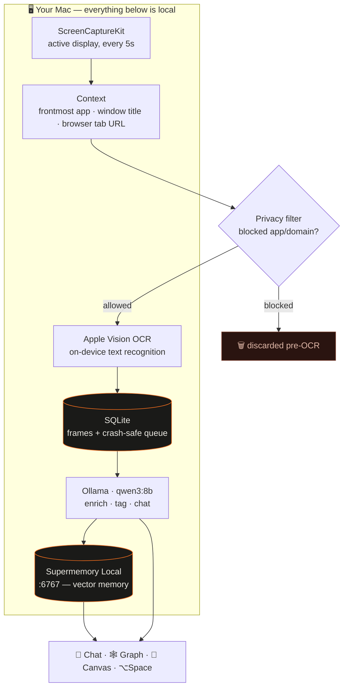
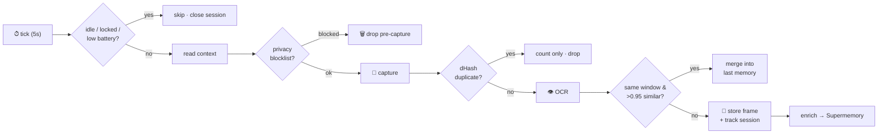
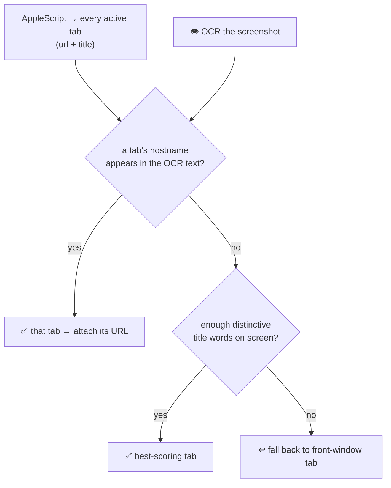

<div align="center">

# 🪶 Muze

### *Your mind, remembered.*

**A local-first macOS app that quietly remembers everything you see — then lets you chat with it, map it, and explore it.**

Muze passively watches your screen, reads the text on it with on-device OCR, and turns your day
into a searchable memory. Then it gives you three ways in: **Chat**, **Graph**, and **Canvas**.
All of it runs on `localhost` — **nothing ever leaves your machine.**

</div>

---

## 🧠 The three ways into your memory

| | | |
|---|---|---|
| 💬 **Chat** | Ask your memory anything in plain language — *"what was that error I saw an hour ago?"* — and get a **synthesized answer with citations**, not a wall of screenshots. Summon it anywhere with **⌥Space**. |
| 🕸 **Graph** | Every memory is a node; semantically related ones link into constellations you can explore. |
| 🎨 **Canvas** | A freeform board — pull memories out and arrange them spatially to think and connect ideas. |

Plus, on the side:

- **⌥S** — deliberately save whatever's on screen right now as a keeper memory.
- **Screen time** — top apps *and* the top **sites inside your browser** (e.g. `youtube.com`, not just "Chrome").
- **MUZE NOTICED** — small insight cards about your day; **STILL RECALL THIS** resurfaces things you'd forgotten.
- **TODAY YOU ARE** — casts your day's consumption into one of **16 mythological archetypes**.

> 📖 Full app docs, build instructions, and deeper diagrams live in **[`Muze/README.md`](Muze/README.md)**.

---

## 🗜 The storage trick — a year of memory in single-digit GB

Screens are huge; text is tiny. **Muze never persists pixels.** A naive screen recorder at
one 1440p frame every 5 seconds is **~50–100 GB a day**; Muze's daily take is **a few MB**,
because every frame has to survive six layers of filtering and compression before it costs
any disk at all:

```
every 5s:  📸 capture ─▶ 🔁 dHash dedupe ─▶ 👁 Vision OCR ─▶ 🗑 discard the frame
                                                          └─▶ 💾 keep ~2–5 KB of text
```

| # | Layer | What it saves |
|---|-------|---------------|
| 1 | **Don't capture at all** | Idle (>2 min), locked screen, low battery (optional), and privacy-blocked apps/domains produce **zero bytes** — blocked frames die *before* OCR, so sensitive screens are never even read. |
| 2 | **Perceptual dedupe** | A 64-bit dHash against the last 5 frames drops **~90% of captures** — static screens and unchanged windows cost nothing. |
| 3 | **Scroll-merge** | Same app + window with **>0.95 text similarity** (Jaccard) just refreshes the previous row's timestamp — scrolling a document ≠ 40 new memories. |
| 4 | **Pixels → text** | The frame is OCR'd (Apple Vision) and **thrown away**; what's kept is ~2–5 KB of text. Thumbnails are opt-in: 480px HEIC at 0.4 quality (~20 KB each). |
| 5 | **One memory per session, not per frame** | Frames group into app-sessions (up to 40 frames / 5-min idle cutoff). Only lines **never seen earlier in the session** make the digest (capped at 6 KB) — repeated UI chrome vanishes. |
| 6 | **Summarize before ingest** | The LLM turns each session into a 1–2 sentence summary + a handful of facts; *that* is what the supermemory engine indexes. The raw OCR text stays local in SQLite. |

And time cleans up after itself:

- **Thumbnails auto-prune** after N days (default 30, Settings → General) — **text is kept forever**,
  because text is what answers questions and it's nearly free.
- **Forget-a-time-range** (Settings) deletes an hour, a day, whatever — from both the local
  SQLite and the memory engine.

**A full day is a few MB. A year fits in single-digit GB.**

---

## 🏗 How it's wired



Everything with a port lives on `localhost`. The only network calls are to `:6767` (Supermemory)
and `:11434` (Ollama) — both on your machine. Prefer a cloud model? Point the provider at OpenAI,
Anthropic, or any OpenAI-compatible endpoint in **Settings → Services**.

---

## ⚙️ The capture pipeline



Muze groups frames into **app-sessions** and builds *one* rich memory per session — a first-person
summary + facts + tags, produced by the local LLM. Full OCR stays in local SQLite; enrichment runs
on a **crash-safe background queue** that never blocks capture.

---

## 🔗 How Muze captures links & context — two sources, not one

The key thing: **links are _not_ scraped out of the screenshot.** Muze pulls info from two
completely different places and reconciles them.

| Info | Where it comes from | How |
|---|---|---|
| **App name + bundle ID** | The OS | `NSWorkspace.shared.frontmostApplication` |
| **Window title** | The OS | macOS Accessibility API — `AXFocusedWindow` → `AXTitle` |
| **Browser URL + tab title** | The OS | AppleScript asking the browser directly |
| **On-screen text** (the actual content) | The pixels | Apple Vision OCR |

So the URL is asked **from the browser itself**, never read out of the image. OCR only reads the
visible text content — it's not where the link comes from.

**Picking the right tab.** A browser has many windows, each with an active tab, so AppleScript
returns *all* of them. Which one is actually on screen? That's the one problem OCR solves — Muze
matches a tab's hostname (e.g. `youtube.com`) or distinctive title words against the OCR'd text:



This is why **Accessibility / Automation permission** is required — without it, the browser refuses
to hand over the URL. The matched URL and title are stored as **structured metadata** on the memory
(alongside `app_name`, `window_title`, `captured_at`), so you can later filter and cite by link,
app, or time — not just fuzzy text.

---

## 🚀 Setup & run

**Prerequisites**

| Dependency | Port | Purpose |
|---|---|---|
| [Supermemory Local](https://supermemory.ai/docs/self-hosting/overview) | `6767` | vector memory store |
| [Ollama](https://ollama.com) + `qwen3:8b` | `11434` | on-device LLM (enrichment, tagging, chat) |

```bash
# 1. start the engines (Muze can also auto-launch them)
supermemory-server                     # :6767
ollama pull qwen3:8b && ollama serve   # :11434

# 2. build & install the app
cd Muze
./Scripts/make-app.sh                  # swift build + .app assembly + codesign + install
open /Applications/Muze.app
```

On first launch, onboarding walks you through granting **Screen Recording** + **Accessibility**
(and optionally **Full Disk Access** for native macOS screen-time). See
**[`Muze/README.md`](Muze/README.md)** for signing notes and troubleshooting.

---

## 🔒 Privacy, by construction

- **Blocklisted apps & domains** (password managers, banking, checkout by default) are discarded
  **before capture** — never OCR'd, never stored.
- **Pause anytime** (15 min / 1 hr / ∞); auto-pause on idle, screen lock, or low battery.
- **You own the data**: export everything to JSONL, or forget any time range (local + engine).
- **Local by default**: with Ollama, screen text never leaves the machine.

---

## 🧩 Tech stack

**Swift · SwiftUI · AppKit** (native macOS) · **ScreenCaptureKit** + **Apple Vision OCR** ·
**SQLite** (GRDB) · **Supermemory Local** (vectors) · **Ollama `qwen3:8b`** (or OpenAI / Anthropic /
custom) · Ovo serif + film-grain design.

---

<div align="center">

*Built for the **Localhost:6767** hackathon — a love letter to memory that never leaves your machine.*

🪶

</div>
